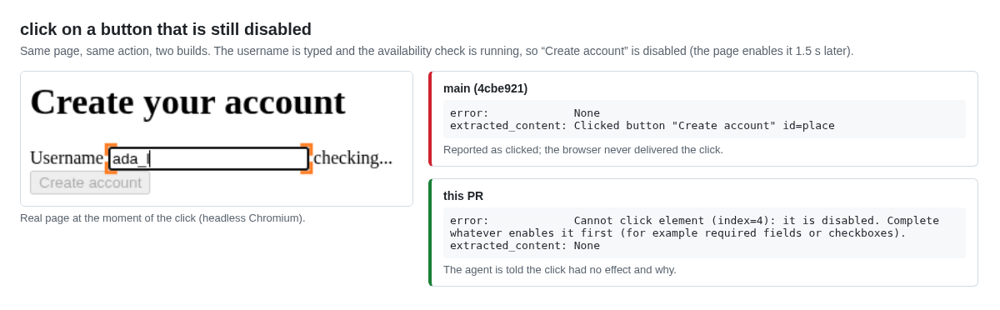

# Evidence: `click` reports success on disabled form controls

Supporting material for the browser-use issue and PR "fix(click): report clicks on disabled form controls as
errors". Base: browser-use `main` at 4cbe921 (0.13.10). Fix: branch `fix/click-disabled-elements`.

## Summary

| Check | main | fix |
| --- | --- | --- |
| `click` on `<button disabled>` with a click listener ([repro](repro/repro_disabled_click.py)) | `error=None`, `Clicked button "Place order"`, handler did not run | `error="Cannot click element (index=3): it is disabled. ..."` |
| Same with a disabled Vue 3 (`@click`) and React 18 (`onClick`) button ([probe](probes/probe_frameworks.py)) | reported as clicked | error |
| New tests `tests/ci/test_click_disabled_element.py` (5) | 2 fail (`error=None`) | 5 pass |
| Full `tests/ci` | | 1208 passed, 35 skipped |
| Agent runs, requirement visible on the page (36) | 18/18 orders | 18/18 orders, same number of actions |
| Agent runs, button enabled 1.5 s after typing (24) | 10/12 orders; the click on the still-disabled button returns `Clicked ...` | 11/12 orders; 7/12 runs got the new error |

The agent runs show the fix does not change normal flows and that the situation occurs; the sample is too small to
claim a difference in outcomes, and none is claimed.

## Demo



Captured from both builds with `demo/demo_capture.py` (raw results in `demo/main_result.json`, `demo/fix_result.json`).

## Contents

- `repro/`: minimal reproduction (no LLM) and its output on both builds.
- `probes/`: deterministic probes against local pages.
  - `probe_disabled.py`: which disabled controls are offered to the agent, what the LLM sees, what `click` reports.
    Result: [`probes/data/probe_disabled.json`](probes/data/probe_disabled.json). A disabled control is offered only
    when it has a click listener (`is_interactive()` checks listeners before `disabled`), shown as `disabled=true`.
  - `probe_stale.py`: the DOM snapshot keeps `disabled` after the page enables the control, so the fix reads the
    live state; a snapshot-based check would block the type-then-click flow (#4518).
  - `probe_frameworks.py`: real Vue 3.5.13 and React 18.3.1 pages (loaded from unpkg).
  - `probe_actions.py`: the first broad sweep of actions (click, input, select, scroll, go_back) that led here.
    Typing into constrained fields already reports the difference; the disabled click was the uncovered case.
- `agent_ab/`: pre-registered agent comparison ([`PROTOCOL.md`](PROTOCOL.md), [`RUNLOG.md`](RUNLOG.md)).
  - `browser_use.Agent`, `use_vision=False`, `max_steps=12`; gpt-4.1-mini, gpt-5.4-mini, gpt-5.6-luna; local
    checkout pages in `scenarios.py`. An order counts only if the page's POST reached the test server.
  - Each run executes in a fresh process with the build selected by path and verified per run (`fix_present`).
  - `data/ab_runs.jsonl` (S1, S2) and `data/s3_runs.jsonl` (S3): every step's actions and results, final answer,
    token usage and cost. `data/toolscore_summary.json`: per-run trace metrics computed with
    [Toolscore](https://github.com/yotambraun/Toolscore) (`identical_count`, `redundant_rate`).
  - `data/ab_invalid_venv_path.jsonl`: a first batch that failed on a runner bug (36 import errors, no model calls),
    kept for completeness and excluded from the results.

## Reproduce

```bash
# from a browser-use checkout with `uv sync --dev` and Chromium installed
uv run python repro/repro_disabled_click.py              # on main: error None / "Clicked ..."
git checkout fix/click-disabled-elements
uv run pytest tests/ci/test_click_disabled_element.py    # 5 passed
```

Agent runs (needs `OPENAI_API_KEY`; about $0.01 per run): place `agent_ab/` next to a `src/` checkout of the fix
branch and a `wt-main/` worktree of main, then `python agent_ab/run_ab.py` and
`python agent_ab/run_ab.py --cells S3 --reps 4 --out data/s3_runs.jsonl`.
